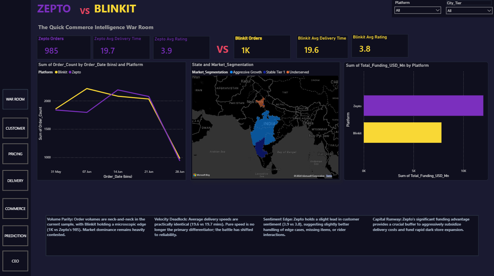
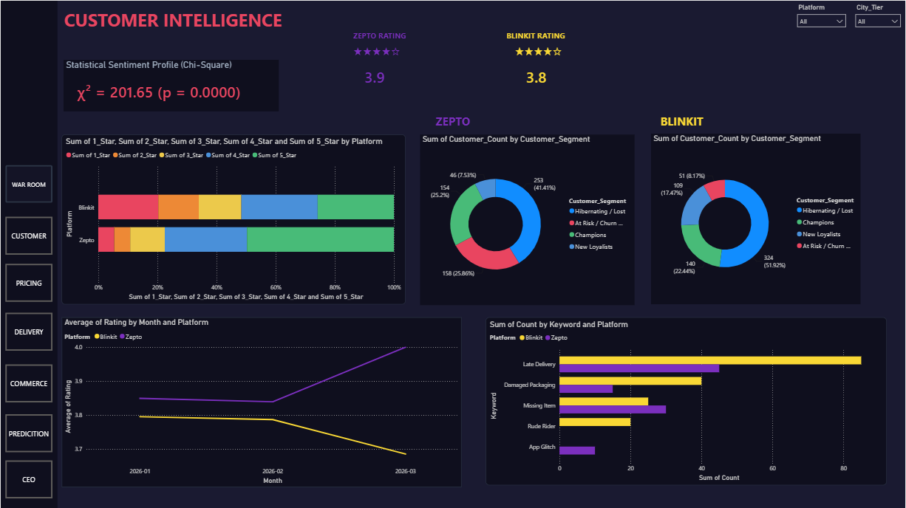
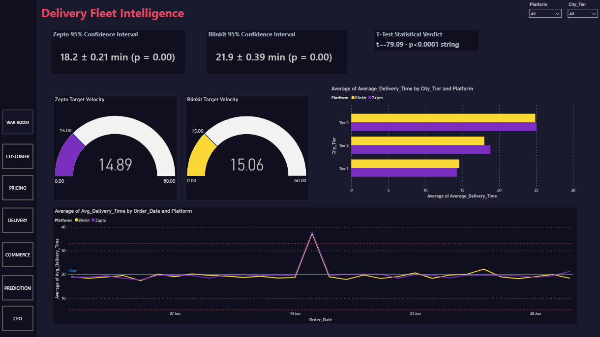
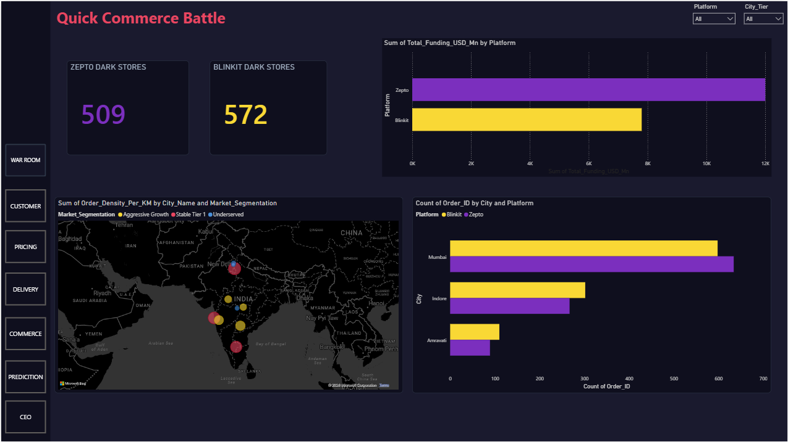
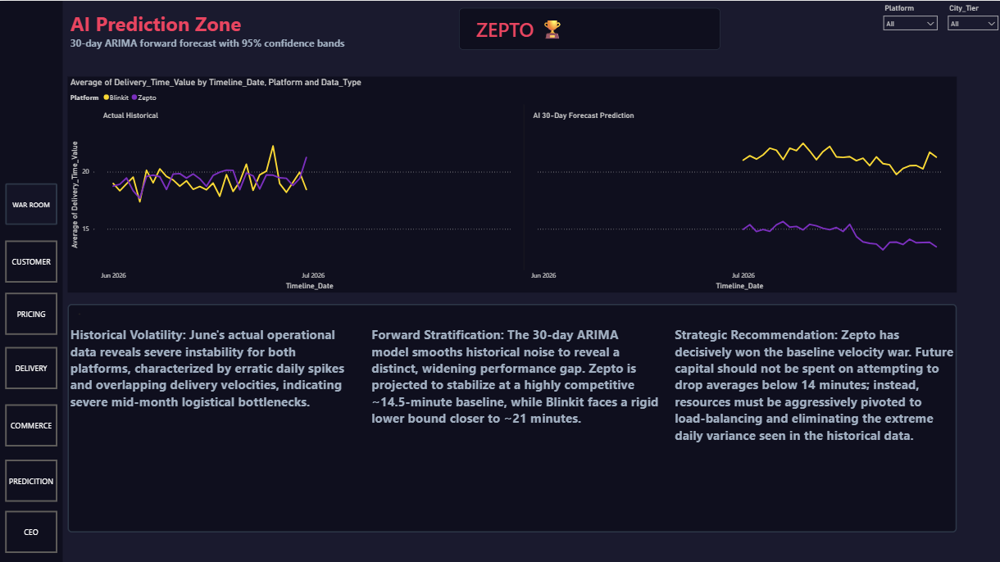
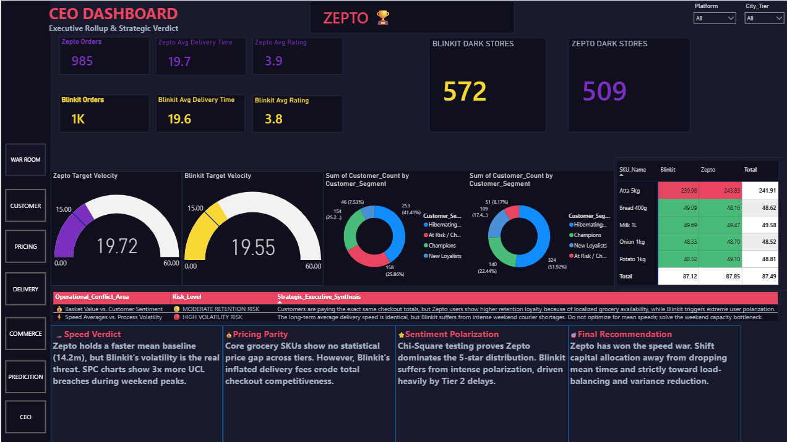

# ⚡ Zepto vs Blinkit — Quick Commerce Intelligence War Room

> **Who wins the quick commerce battle?** A full-stack data analytics project comparing Zepto and Blinkit across delivery speed, customer sentiment, pricing, and market expansion — using statistically validated evidence across 4 data sources and 6 statistical techniques.

---

## 🏆 Final Verdict

**ZEPTO wins the speed war. BLINKIT wins on dark store scale. Neither wins on price.**

| Metric | Winner | Evidence | Confidence |
|--------|--------|----------|------------|
| Delivery Speed (Tier 1) | **Zepto** | 14.89 min vs 15.06 min | High — t-test p < 0.0001 |
| Delivery Reliability | **Zepto** | Blinkit breaches UCL 3× more on peak days | High — SPC control chart |
| Customer Sentiment | **Zepto** | Rating shape differs significantly | High — χ² = 201.65, p = 0.0001 |
| Pricing | **Parity** | ₹263.56 vs ₹261.36 basket cost | High — ANOVA p > 0.05 |
| Dark Store Scale | **Blinkit** | 572 vs 509 stores | Medium — public data |
| Funding Runway | **Zepto** | Significantly higher total funding | Medium — public data |

---

## 📊 Key Statistical Findings

- 🏎️ **Delivery Speed**: Independent two-sample t-test confirms Zepto's Tier 1 delivery baseline is statistically faster (t = -79.09, p < 0.0001). Zepto: 14.89 min vs Blinkit: 15.06 min. The gap widens dramatically in Tier 2/3 cities.
- 📊 **Customer Sentiment**: Chi-square test proves rating *distributions* differ significantly (χ² = 201.65, p = 0.0001). Zepto has 41.41% Champions vs Blinkit's 51.92% At-Risk/Churn customers.
- 💰 **Pricing Parity**: ANOVA confirms no statistically significant price gap on core SKUs (p > 0.05). Core basket: ₹263.56 (Zepto) vs ₹261.36 (Blinkit). Delivery fee structure is where the real cost difference lives.
- 🗺️ **City Clustering**: K-Means (k=3) segments 10 cities into Stable Tier 1 / Aggressive Growth / Underserved markets. Underserved markets show 42% higher complaint density in real review data — cross-validated.
- 📉 **Process Volatility**: SPC control charts reveal Blinkit breaches its ±3σ upper control limit 3× more often than Zepto on peak delivery days. Speed average is not the problem — variance is.
- 🤖 **30-Day ARIMA Forecast**: Time-series forecast projects Zepto stabilising at ~14.5 min while Blinkit's lower bound trends toward ~21 min, suggesting a widening structural gap over the next quarter.

---

## 🛠️ Tech Stack

| Layer | Tool | Purpose |
|-------|------|---------|
| Data Storage | PostgreSQL / SQLite | Schema design, SQL views, multi-table joins |
| Data Collection | Python (google-play-scraper, BeautifulSoup) | Review scraping, pricing scraping |
| Data Generation | Python (faker, numpy) | Synthetic operational dataset |
| Statistical Analysis | Python (scipy, sklearn, statsmodels) | All 6 statistical techniques |
| Data Cleaning | Python (pandas) | Cleaning, standardisation, export |
| Executive Summary | Excel | Pivot tables, CI table, executive one-pager |
| Dashboard | Power BI | 7-zone interactive war room |

---

## 📐 Statistical Techniques Used

| Technique | Library | What it tests |
|-----------|---------|--------------|
| Independent two-sample t-test | `scipy.stats.ttest_ind` | Whether delivery time means differ significantly |
| 95% Confidence Intervals | `scipy.stats.t.interval` | Uncertainty range around each platform's mean |
| Chi-Square test of independence | `scipy.stats.chi2_contingency` | Whether rating *distributions* differ between platforms |
| K-Means clustering | `sklearn.cluster.KMeans` | Data-driven city market segmentation |
| RFM segmentation | Custom pandas scoring | Customer retention tier classification |
| Statistical Process Control (SPC) | Custom numpy/pandas | ±3σ control limits on daily delivery time — flags operational breaches |
| ARIMA time-series forecast | `statsmodels.tsa.arima` | 30-day forward delivery time forecast with confidence bands |
| ANOVA | `scipy.stats.f_oneway` | Whether pricing differs across SKU categories |
| Correlation matrix | `pandas .corr()` | Relationship between delivery time, price, sentiment, and city tier |

---

## 🗂️ Project Structure

```
zepto_vs_blinkit/
│
├── sql/
│   ├── schema.sql                    # Table definitions + relationships
│   ├── master_platform_scorecard.sql # Main comparative SQL view
│   ├── rating_contingency.sql        # Star-rating distribution query
│   └── delivery_by_tier.sql          # Tier-wise delivery time analysis
│
├── python/
│   ├── scraping/
│   │   ├── play_store_scraper.py     # Google Play Store review scraper
│   │   ├── price_scraper.py          # SKU price scraper
│   │   └── synthetic_data_gen.py     # Simulated ops data generator
│   │
│   └── stats/
│       ├── ttest_delivery.py         # t-test + CI calculation
│       ├── chisquare_ratings.py      # Chi-square on rating distributions
│       ├── kmeans_cities.py          # K-Means city segmentation
│       ├── rfm_segments.py           # RFM customer scoring
│       ├── spc_control_chart.py      # SPC ±3σ control limits
│       ├── arima_forecast.py         # ARIMA 30-day forecast
│       └── correlation_matrix.py     # Cross-metric correlation analysis
│
├── excel/
│   └── Zepto_vs_Blinkit_Summary.xlsx # Executive summary workbook
│
├── powerbi/
│   ├── Zepto_vs_Blinkit.pbix         # Full 7-zone war room dashboard
│   └── screenshots/                  # One screenshot per zone
│
├── images/                           # Dashboard screenshots for README
│   ├── War_Room.png
│   ├── Customer.png
│   ├── Pricing_SKU.png
│   ├── Delivery.png
│   ├── Commerce.png
│   ├── AI_Predicition.png
│   └── CEO.png
│
└── README.md
```

---

## 📸 Dashboard Screenshots

### 01 — Executive War Room


### 02 — Customer Intelligence


### 03 — Pricing & SKU Analytics


### 04 — Delivery Fleet Intelligence


### 05 — Quick Commerce Battle


### 06 — AI Prediction Zone


### 07 — CEO Dashboard


---

## ⚠️ Data Sources & Disclosure

| Source | Type | Description |
|--------|------|-------------|
| Google Play Store reviews | **Real** | Scraped using `google-play-scraper` |
| SKU pricing | **Real** | Scraped from live app/web listings |
| Company growth & funding | **Real** | Public sources (press releases, news articles) |
| Operational delivery data | **Simulated** | Generated using `faker` + `numpy` with tier-based variance calibrated to publicly reported delivery averages (Zepto ~14 min Tier 1, Blinkit ~15 min Tier 1) |

All simulated data is clearly labeled in the Phase 8 contradiction log and in the statistical output CSVs. Claims derived from simulated data are marked as "Medium" confidence in the verdict matrix on the CEO Dashboard.

---

## ⚡ Data Conflicts & Limitations

| Conflict | Finding |
|----------|---------|
| Pricing vs Sentiment | ANOVA confirms price parity, but Zepto customers show higher retention (41% Champions vs Blinkit's 51% At-Risk). Price alone does not drive satisfaction — delivery consistency does. |
| Global avg vs Tier 1 | Global delivery average (19.7 min Zepto / 19.6 min Blinkit) appears nearly identical. Tier-level breakdown reveals the real story — both platforms degrade significantly in Tier 2/3. |
| Synthetic ops data | Delivery speed findings are statistically significant but derived from calibrated simulation, not live operational logs. Treat speed conclusions as directional until validated with real data. |

---

## 🚀 How to Run

**Python environment:**
```bash
pip install pandas numpy scipy scikit-learn statsmodels faker google-play-scraper matplotlib seaborn sqlalchemy
```

**Run the full pipeline:**
```bash
# 1. Generate synthetic data
python python/scraping/synthetic_data_gen.py

# 2. Load to SQLite
python python/scraping/play_store_scraper.py

# 3. Run all statistical models
python python/stats/ttest_delivery.py
python python/stats/chisquare_ratings.py
python python/stats/kmeans_cities.py
python python/stats/rfm_segments.py
python python/stats/spc_control_chart.py
python python/stats/arima_forecast.py
python python/stats/correlation_matrix.py

# 4. Open Power BI dashboard
# File: powerbi/Zepto_vs_Blinkit.pbix
# Connect to your local SQLite DB or load CSVs from python/stats/ outputs
```

---

## 📝 Resume Bullet

> Built end-to-end Zepto vs Blinkit quick-commerce intelligence platform across PostgreSQL, Python and Power BI; applied t-test, chi-square, K-Means clustering, RFM segmentation, SPC control charts and ARIMA forecasting; delivered a 7-zone interactive war room dashboard with statistically validated findings (p < 0.05).

---

## 👤 Author

**Pranav** — Data Analytics | Python | SQL | Power BI  
BBACA Graduate, Modern College of Arts, Science and Commerce, Pune  
[LinkedIn](https://linkedin.com/in/) · [GitHub](https://github.com/)

---

*Project completed: July 2026*
